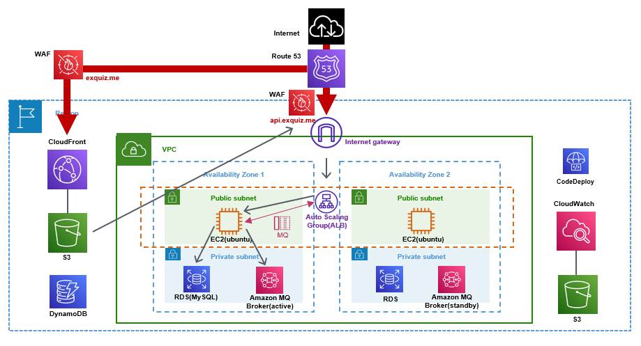
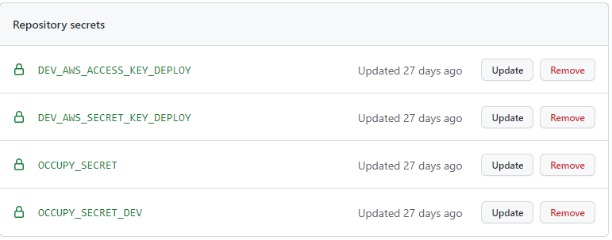
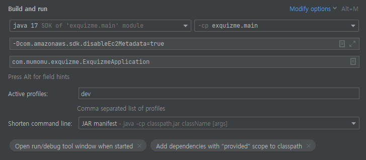
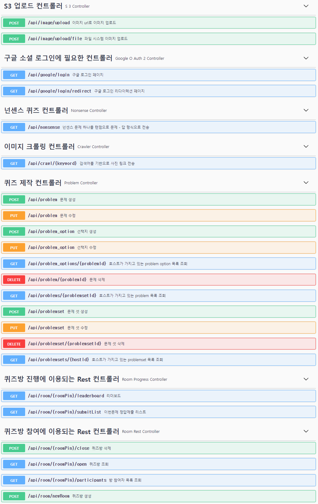

# What's <span style="color:white">ex</span><span style="color:orange">quiz</span><span style="color:white">.me</span>?
## 웹 실시간 참여형 퀴즈 플랫폼
exquiz.me는 웹에서 진행할 수 있는 퀴즈 출제 및 참여 플랫폼이며, 구글 OAuth2 Login을 통해 퀴즈를 출제할 수 있고, 방을 만들어 참여자들이 참가할 수 있습니다. 참여자는 로그인을 사용하지 않고 참여할 수 있고, 각 퀴즈별로 리더보딩과 해설, 최종 순위를 제공합니다.

## Live Demo (프론트엔드 미완성, 22년 11월까지 개발 예정)
### <a href="https://www.exquiz.me">exquiz.me</a>

[//]: # (## https://www.exquiz.me)

[//]: # (&#40;10월 중으로 디자인 외주 반영 예정&#41;)

<br>

## Getting Started
- #### Java 17
- #### Aws credentials (accessKey & secretKey)
    - Need Roles:
        - S3FullAccess
        - CloudWatchFullAccess
- #### AmazonMQ - ActiveMQ(also local ActiveMQ is possible, but you must fix StompConfig.java)
- #### Google Cloud Platform register for Google Oauth2 Login
- #### set project active profiles "dev"
- #### create "application-dev-secret.yml"
  - #### set yml file
   ```
  cloud:
    aws:
      credentials:
        access-key: {your aws credential access key}
        secret-key: {your aws crendential secret key}
      region:
        static: ap-northeast-2
      stack:
        auto: false
    s3:
      bucket: {your own s3 name}
  spring:
    activemq:
      broker-port: 61614
      broker-url: failover:(ssl://{your-own-activemq-active-server-url}.mq.ap-northeast-2.amazonaws.com:61617,ssl://{your-own-activemq-standby-server-url}.mq.ap-northeast-2.amazonaws.com:61617)
      user: {your-own-activemq-user}
      password: {your-own-activemq-passwd}
      topic:
        name: room # for test
      activeMQServerList: {your-own-activemq-active-server-url}.mq.ap-northeast-2.amazonaws.com, {your-own-activemq-standby-server-url}.mq.ap-northeast-2.amazonaws.com
    datasource:
      url: {your-own-database-url} # I used H2, MySQL in my project with JPA
        username: {your-db-username}
        password: {your-db-passwd}
        driver-class-name: 
    jms:
      pub-sub-domain: true
        security:
        oauth2:
    client:
      registration:
        google: # google oauth2 login 
          auth-url: https://oauth2.googleapis.com
          login-url: https://accounts.google.com
          redirect-uri-local: http://localhost:8080/api/google/login/redirect/local
          redirect-uri-prod: http://localhost:8080/api/google/login/redirect/prod
          client-id: {your-own-client-id}.apps.googleusercontent.com
          client-secret: {your-own-client-secret}
          scope: profile,email
    # local 환경
    servlet:
      multipart:
        max-file-size: 20MB
        max-request-size: 20MB
    jwt:
      header: Authorization
    # HS512 알고리즘을 사용할 것이기 때문에 512bit, 즉 64byte 이상의 secret key를 사용해야 한다.
    secret: {secret-key}
    token-validity-in-seconds: 86400
    ```
  
- #### launch project
      $ nohup java -jar -Dspring.profiles.active=dev {jar-file-name}.jar &
      
  - <a href="http://localhost:8080">localhost:8080</a>
  - <a href="http://localhost:8080/swagger-ui/#">localhost:8080/swagger-ui/#</a>

## Stack
- ### Backend 
 


- ### 협업툴


## AWS Architecture 


## CI/CD
    GitAction + AWS CodeDeploy
- ### .github/workflows/gradle.yml 
  - set on github repository secret
      - need keys about CodeDeployFullAccess Role
      - encode secret file on base 64 and upload
      
- ### script/deploy.sh
  - change directory name and profiles for launching on aws ec2

## Build error
  - #### edit configuration
          VM Options : -Dcom.amazonaws.sdk.disableEc2Metatdata=true
          Active profiles : dev  
          Shorten command line : Jar manifest
  - #### /test/resoucres에도 applcation-dev-secret.yml 추가
    <br>
<br>

## Function
### 퀴즈 제작(RESTFUL API)
    - Google OAuth2 Login
    - 퀴즈 종류 선택(OX, 객관식, 주관식)
    - 퀴즈 사진 크롤링(구글, 파일 시스템)
    - 퀴즈 사진 저장(S3)
    - 넌센스 퀴즈 조회
    - 퀴즈 등록
    - 퀴즈 수정
    - 퀴즈 검색

### 퀴즈 참여(RESTFUL API + STOMP(SOCKJS with ActiveMQ))
    - 퀴즈 방 생성
    - 퀴즈 방 참여
      - 정답 제출
      - OX 퀴즈 현재 위치 전송
    - 리더보드

### ScreenShots


### RESTFUL API 목록 
    localhost:8080/swagger-ui/#


### STOMP API 목록
#### ToWhom
    - ToAllSubscriber : 모든 구독자에게 보내는 것
    - ToHostSubscriber : 호스트에게 보내는 것
    - ToClientSubscriber : 참여자들에게 보내는 것
#### EndPoint
    - host subscribe 주소 : /topic/room/{roomPin}/host
    - participant subscribe 주소 : /topic/room/{roomPin}
    - host publish주소 : /pub/room/{roomPin}/@@
    - participant publish 주소 : /pub/room/{roomPin}/@@
#### APIs
```java
[ToHostSubscriber]
Event Name:
        /room/{roomPin}

Path Variable:
        "roomPin" : String // 방 번호

Args:

Callback:
{
        "messageType" : MessageType // "PARTICIPANT"
        "fromSession" : String, // 사용자 session id - google login시 발급
        "id" : Long  // 사용자 id 
        "name" : String // 사용자 구분 이름 
        "nickname" : String // 사용자 닉네임
        "entryDate" : Date // 생성일(입장시간) 
        "currentScore" : int // 점수 
        "imageNumber" : int // 사용자 이미지 
        "colorNumber" : int // 사용자 배경색
}

Description:
        "기존 세션 정보가 있는지 확인 후 재 입장 혹은 가입씬으로 이동 시키는 API"
        // enter.tsx 입장하기 누르면 이걸 호출
        // if session exists: 로비로 이동
        // if session not exists: 사용자 정보 입력(회원가입 느낌)
```

```java
[ToAllSubscriber]
Event Name:
        /room/{roomPin}/signup

Path Variable:
        "roomPin" : String // 방 번호

Args:
{
        "name" : String
        "nickname" : String
        "imageNumber" : int
        "colorNumber" : int
}

Callback:
{
        "messageType" : MessageType // "PARTICIPANT"
        "fromSession" : String, // 사용자 session id - google login시 발급
        "id" : Long  // 사용자 id 
        "name" : String // 사용자 구분 이름 
        "nickname" : String // 사용자 닉네임
        "entryDate" : Date // 생성일(입장시간) 
        "currentScore" : int // 점수 
        "imageNumber" : int // 사용자 이미지 
        "colorNumber" : int // 사용자 배경색
}

Description:
        "방 입장을 위해서 닉네임과 이름을 입력하는 API"
        // 준비 완료 버튼을 누르면 signup이 호출
        // cloudwatch -> log group -> exquiz.me error folder
```

```java
[ToClientSubscriber]
Event Name:
        /room/{roomPin}/start

Path Variable:
        "roomPin" : String // 방 번호

Args:

Callback:
{
        "messageType" : MessageType // "NEWPROBLEM"
        "fromSession" : String, // 사용자 session id - google login시 발급
        "id" : Long;
        "title" : String;
        "description" : String;
        "dtype" : String;
        "timelimit" : Integer;
        "score" : Integer;
        "picture" : String;
        "answer" : String;
        "idx" : Integer;
}

Description:
        "방을 시작하고 사용자에게 전파하는 API"
        // 선생님 화면에서 시작하기 버튼 누르면
        // subscriber들인 학생+교사들 화면에 변화가 생김
```

```java
[ToClientSubscriber]
Event Name:
        /room/{roomPin}/stop

Path Variable:
        "roomPin" : String // 방 번호

Args:

Callback:
{
        "messageType" : MessageType // "STOP"
        "fromSession" : String, // null
}

Description:
        "방을 시작하고 사용자에게 전파하는 API"
        // 선생님 화면에서 시작하기 버튼 누르면
        // subscriber들인 학생+교사들 화면에 변화가 생김
```

```java
[ToClientSubscriber]
Event Name:
        /room/{roomPin}/next

Path Variable:
        "roomPin" : String // 방 번호

Args:

Callback:
{
        "messageType" : MessageType // "NEWPROBLEM"
        "fromSession" : String, // 사용자 session id - google login시 발급
        "id" : Long;
        "title" : String;
        "description" : String;
        "dtype" : String;
        "timelimit" : Integer;
        "score" : Integer;
        "picture" : String;
        "answer" : String;
        "idx" : Integer;
}

Description:
        "방의 다음 문제를 사용자에게 전파하는 API"
        // 교사가 next 누르면 학생/교사 화면 전환
```

```java
[ToAllSubscriber]
Event Name:
        /room/{roomPin}/move

Path Variable:
        "roomPin" : String // 방 번호

Args:
{
        "messageType" : MessageType // 반드시 "ANSWER"
        "fromSession": String, // 사용자 session id - google login시 발급
        "problemIdx" : int; // 문제 번호
        "x" : int;
        "y" : int;
}

Callback:
{
        "messageType" : MessageType // 반드시 "ANSWER"
        "fromSession" : String, // 사용자 session id - google login시 발급
        "problemIdx" : int; // 문제 번호
        "x" : int;
        "y" : int;
}

Description:
        "OX 퀴즈에서 실시간 참여자의 움직임을 보내주는 API"
        // 교사가 next 누르면 학생/교사 화면 전환
```

```java
[ToHostSubscriber]
Event Name:
        /room/{roomPin}/submit

Path Variable:
        "roomPin" : String // 방 번호

Args:
{
        "messageType" : MessageType // 반드시 "ANSWER"
        "fromSession" : String, // 사용자 session id - google login시 발급
        "problemIdx" : int, // 제출한 문제의 번호
        "answerText" : String // 문제 정답
}

Callback:
{
        "messageType" : MessageType // "ANSWER"
        "fromSession" : String, // 사용자 session id - google login시 발급
        "problemIdx" : int, // 제출한 문제의 번호
        "answerText" : String // 문제 정답
}

Description:
        "각 방에 대한 문제를 제출할 때 사용자가 사용하는 API"
        // 정답 제출
        // 각 사용자의 정답을 모든 subscriber에게 전달
```
