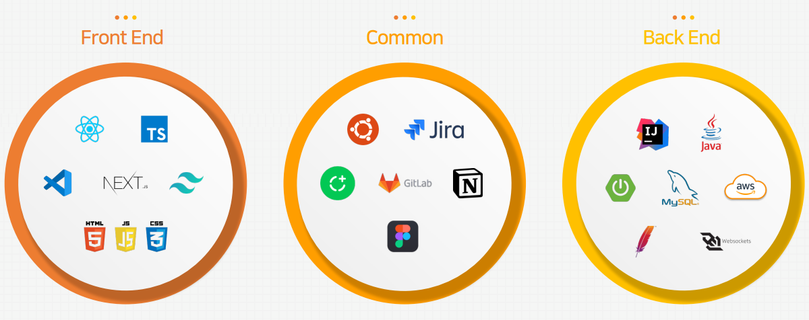
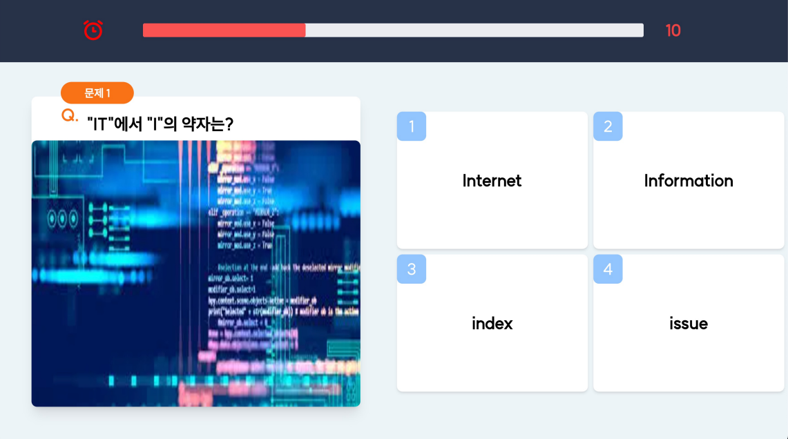

# What's <span style="color:white">ex</span><span style="color:orange">quiz</span><span style="color:white">.me</span>?
## 웹 실시간 참여형 퀴즈 플랫폼
exquiz.me는 웹에서 진행할 수 있는 퀴즈 출제 및 참여 플랫폼이며, 구글 OAuth2 Login을 통해 퀴즈를 출제할 수 있고, 방을 만들어 참여자들이 참가할 수 있습니다. 참여자는 로그인을 사용하지 않고 참여할 수 있고, 각 퀴즈별로 리더보딩과 해설, 최종 순위를 제공합니다.

## Live Demo
### <a href="https://www.exquiz.me">exquiz.me</a>

### 팀 소개
| 이름   | 파트           | 주요역할                                                         |
|---------|--------------|--------------------------------------------------------------|
| 이상빈 | 팀장, 백엔드      | 퀴즈 참여파트(distribution, 웹소켓), 시큐리티, <br/>CI/CD, AWS 인프라 구축, 프론트엔드 보조 |
| 김민겸 | 팀원, 백엔드      | 퀴즈 제작파트(production), DB 설계, 리더보딩 시스템                         |
| 임준현 | 팀원, 프론트엔드    | 프론트엔드 전반                                                     |
<br>

### 멘토 소개
| 파트        | 주요역할                                                  |
|-----------|-------------------------------------------------------|
| 인프라 멘토    | A사 Principal Solutions Architect, 전 MS 소프트웨어연구소 책임연구원 |
| 프론트엔드 멘토   | (주) 시더 CTO                                            |
| 백엔드 멘토    | (주) 휴먼스케이프 CIC Chief Technology Officer, Rarenote     |
<br>

## Getting Started
- #### Java 17
- #### Aws credentials (accessKey & secretKey)
    - Need Roles:
        - S3FullAccess
        - CloudWatchFullAccess
- #### AmazonMQ - ActiveMQ(also local ActiveMQ is possible, but you must fix StompConfig.java)
- #### Google Cloud Platform register for Google Oauth2 Login
- #### set project active profiles "dev"
- #### create "application-dev-secret.yml"
  - #### set yml file
   ```
  cloud:
    aws:
      credentials:
        access-key: {your aws credential access key}
        secret-key: {your aws crendential secret key}
      region:
        static: ap-northeast-2
      stack:
        auto: false
    s3:
      bucket: {your own s3 name}
  spring:
    activemq:
      broker-port: 61614
      broker-url: failover:(ssl://{your-own-activemq-active-server-url}.mq.ap-northeast-2.amazonaws.com:61617,ssl://{your-own-activemq-standby-server-url}.mq.ap-northeast-2.amazonaws.com:61617)
      user: {your-own-activemq-user}
      password: {your-own-activemq-passwd}
      topic:
        name: room # for test
      activeMQServerList: {your-own-activemq-active-server-url}.mq.ap-northeast-2.amazonaws.com, {your-own-activemq-standby-server-url}.mq.ap-northeast-2.amazonaws.com
    datasource:
      url: {your-own-database-url} # I used H2, MySQL in my project with JPA
        username: {your-db-username}
        password: {your-db-passwd}
        driver-class-name: 
    jms:
      pub-sub-domain: true
        security:
        oauth2:
    client:
      registration:
        google: # google oauth2 login 
          auth-url: https://oauth2.googleapis.com
          login-url: https://accounts.google.com
          redirect-uri-local: http://localhost:8080/api/google/login/redirect/local
          redirect-uri-prod: http://localhost:8080/api/google/login/redirect/prod
          client-id: {your-own-client-id}.apps.googleusercontent.com
          client-secret: {your-own-client-secret}
          scope: profile,email
    # local 환경
    servlet:
      multipart:
        max-file-size: 20MB
        max-request-size: 20MB
    jwt:
      header: Authorization
    # HS512 알고리즘을 사용할 것이기 때문에 512bit, 즉 64byte 이상의 secret key를 사용해야 한다.
    secret: {secret-key}
    token-validity-in-seconds: 86400
    ```
  
- #### launch project
      $ nohup java -jar -Dspring.profiles.active=dev {jar-file-name}.jar &
      
  - <a href="http://localhost:8080">localhost:8080</a>
  - <a href="http://localhost:8080/swagger-ui/#">localhost:8080/swagger-ui/#</a>

## Tech Stack


[//]: # ( )

[//]: # ()

[//]: # ()

[//]: # ()

[//]: # ()
[//]: # (- ### 협업툴)

[//]: # (![Figma]&#40;https://img.shields.io/badge/figma-%23F24E1E.svg?style=for-the-badge&logo=figma&logoColor=white&#41;)

[//]: # ()

[//]: # ()


## AWS Architecture 


## CI/CD
    GitAction + AWS CodeDeploy
- ### .github/workflows/gradle.yml 
  - set on github repository secret
      - need keys about CodeDeployFullAccess Role
      - encode secret file on base 64 and upload
      
- ### script/deploy.sh
  - change directory name and profiles for launching on aws ec2

## Build error
  - #### edit configuration
          VM Options : -Dcom.amazonaws.sdk.disableEc2Metatdata=true
          Active profiles : dev  
          Shorten command line : Jar manifest
  - #### /test/resoucres에도 applcation-dev-secret.yml 추가
    <br>
<br>

## Function
### 퀴즈 제작(RESTFUL API)
    - Google OAuth2 Login
    - 퀴즈 종류 선택(OX, 객관식, 주관식)
    - 퀴즈 사진 크롤링(구글, 파일 시스템)
    - 퀴즈 사진 저장(S3)
    - 넌센스 퀴즈 조회
    - 퀴즈 등록
    - 퀴즈 수정
    - 퀴즈 검색

### 퀴즈 참여(RESTFUL API + STOMP(SOCKJS with ActiveMQ))
    - 퀴즈 방 생성
    - 퀴즈 방 참여
      - 정답 제출
      - OX 퀴즈 현재 위치 전송
    - 리더보드

## ScreenShots





