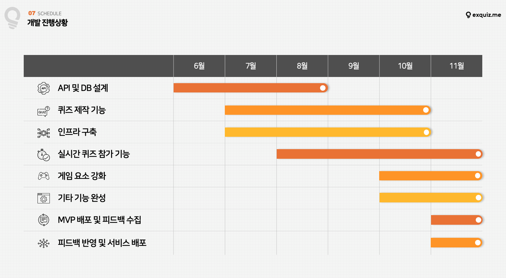

# exquiz.me
실시간 참여형 퀴즈 플랫폼(11월까지 개발 중) 

[//]: # (## https://www.exquiz.me)

[//]: # (&#40;10월 중으로 디자인 외주 반영 예정&#41;)

## project launch
    nohup java -jar -Dspring.profiles.active=prod {jar-file-name}.jar &

## Stack
 


## AWS Architecture 


## CI/CD
    GitAction + AWS CodeDeploy

## Function
### 퀴즈 제작(RESTFUL API)
    - Google OAuth2 Login
    - 퀴즈 종류 선택(OX, 객관식, 주관식)
    - 퀴즈 사진 크롤링(구글, 파일 시스템)
    - 퀴즈 사진 저장(S3)
    - 넌센스 퀴즈 조회
    - 퀴즈 등록
    - 퀴즈 수정
    - 퀴즈 검색

### 퀴즈 참여(RESTFUL API + STOMP(SOCKJS with ActiveMQ))
    - 퀴즈 방 생성
    - 퀴즈 방 참여
      - 정답 제출
      - OX 퀴즈 현재 위치 전송
    - 리더보드

### RESTFUL API 목록


### STOMP API 목록
- 웹소켓 컨트롤러 API 명세
    - Emit : 클라이언트에서 서버로 보내는 것
    - On : 서버에서 클라이언트로 보내는 것
    <br>
    - host subscribe 주소 : /topic/room/{roomPin}/host
    - participant subscribe 주소 : /topic/room/{roomPin}
    - host publish주소 : /pub/room/{roomPin}/@@
    - participant publish 주소 : /pub/room/{roomPin}/@@
  
  
    ```java
    [Emit]
    Event Name:
    /room/{roomPin}
    
    Path Variable:
    "roomPin" : String // 방 번호
    
    Args: 
    
    Callback:
    {
    		MessageFlag flag; // PARTICIPANT
    		String fromSession;
    		Long id;
    		String sessionId;
    		String name; // 사용자 구분 이름
    		String nickname;
    		RoomDto roomDto;
    		Date entryDate; // 생성일(입장시간)
    		int currentScore; // 점수
    }
    
    Description:
    "기존 세션 정보가 있는지 확인 후 재 입장 혹은 가입씬으로 이동 시키는 API"
    // enter.tsx 입장하기 누르면 이걸 호출
    // if session exists: 로비로 이동
    // if session not exists: 사용자 정보 입력(회원가입 느낌)
    ```

    ```java
    [Emit][On]
    Event Name:
    /room/{roomPin}/signup
    
    Path Variable:
    "roomPin" : String // 방 번호
    
    Args: 
    {
    		"name" : String
    		"nickname" : String
    }
    
    Callback:
    {
    		MessageFlag flag; // PARTICIPANT
    		String fromSession;
    		Long id;
    		String name; // 사용자 구분 이름 -> 이름보고 자신의 이름과 동일하다면 자신의 세션을 로컬스토리지에 기록
    		String nickname;
    		RoomDto roomDto;
    		Date entryDate; // 생성일(입장시간)
    		int currentScore; // 점수
    }
    
    Description:
    "방 입장을 위해서 닉네임과 이름을 입력하는 API"
    // 준비 완료 버튼을 누르면 signup이 호출
    // cloudwatch -> log group -> exquiz.me error folder
    ```

    ```java
    [On]
    Event Name:
    /room/{roomPin}/start
    
    Path Variable:
    "roomPin" : String // 방 번호
    
    Args: 
    
    Callback:
    {
    		MessageFlag flag; // "NEWPROBLEM"
    		String fromSession;
    		Long id;
        String title;
    	  String description;
    		String dtype;
        Integer timelimit;
        Integer score;
        String picture;
        String answer;
        Integer idx;
    }
    
    Description:
    "방을 시작하고 사용자에게 전파하는 API"
    // 선생님 화면에서 시작하기 버튼 누르면
    // subscriber들인 학생+교사들 화면에 변화가 생김
    ```

    ```java
    [On]
    Event Name:
    /room/{roomPin}/next
    
    Path Variable:
    "roomPin" : String // 방 번호
    
    Args: 
    
    Callback:
    {
    		MessageFlag flag; // "NEWPROBLEM"
    		String fromSession;
    		Long id;
        String title;
    	  String description;
    		String dtype;
        Integer timelimit;
        Integer score;
        String picture;
        String answer;
        Integer idx;
    }
    
    Description:
    "방의 다음 문제를 사용자에게 전파하는 API"
    // 교사가 next 누르면 학생/교사 화면 전환
    ```

    ```java
    [Emit][On]
    Event Name:
    /room/{roomPin}/move
    
    Path Variable:
    "roomPin" : String // 방 번호
    
    Args: 
    {
    		MessageFlag flag; // 반드시 "MOVE_DATA"
    		String fromSession; // 보내는 사람 세션
    		int problemIdx; // 문제 번호
    		int y;
    		int x;
    }
    
    Callback:
    {
    		MessageFlag flag; // "MOVE_DATA"
    		String fromSession; // 보내는 사람 세션
    		int problemIdx; // 문제 번호
    		int y;
    		int x;
    }
    
    Description:
    "OX 퀴즈에서 실시간 참여자의 움직임을 보내주는 API"
    // 교사가 next 누르면 학생/교사 화면 전환
    ```

    ```java
    [Emit]
    Event Name:
    /room/{roomPin}/submit
    
    Path Variable:
    "roomPin" : String // 방 번호
    
    Args: 
    {
    	"flag": MessageFlag // 반드시 "ANSWER"
    	"fromSession": String, // 사용자 session id - google login시 발급
    	"problemIdx": int, // 제출한 문제의 번호
    	"answerText": String // 문제 정답
    }
    
    Callback:
    {
    	"flag": MessageFlag // "ANSWER"
    	"fromSession": String, // 사용자 session id - google login시 발급
    	"problemIdx": int, // 제출한 문제의 번호
    	"answerText": String // 문제 정답
    }
    
    Description:
    "각 방에 대한 문제를 제출할 때 사용자가 사용하는 API"
    // 정답 제출
    // 각 사용자의 정답을 모든 subscriber에게 전달
    ```

